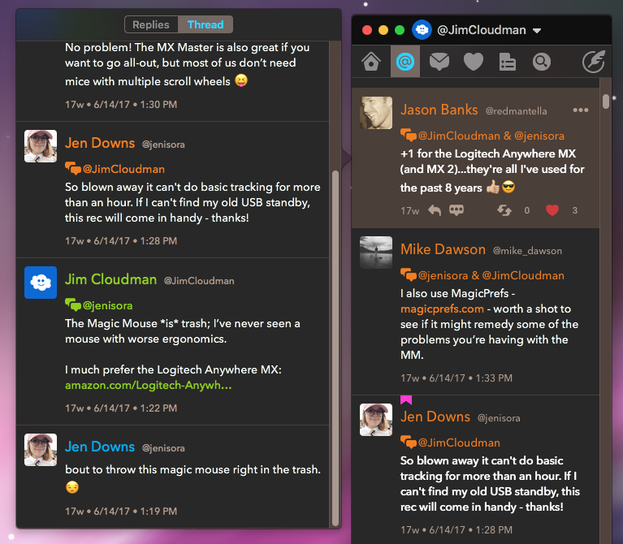

# twitterrific-monokai
Simple dark theme for Twitterrific 5, heavily inspired by [Sublime Text](http://www.sublimetext.com/)'s famous Monokai code highlighting theme.

## To install
1. Download the [TwitterrificMonokai.plist](https://github.com/jimcloudman/twitterrific-monokai/raw/master/TwitterrificMonokai.plist) file to your computer
2. In Twitterrific, hold down Option as you click **Twitterrific** -> **Preferences...** in the menu.
3. Go to the Theme tab, click Import and select the theme file you downloaded.
